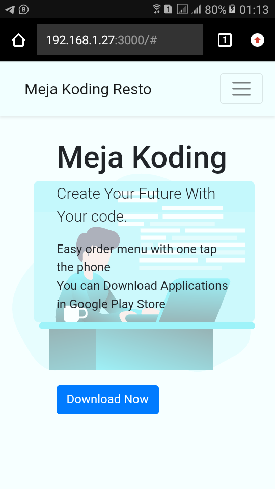

# Meja Koding Landing Page

## Screenshot

  
  

## Clone to Your Local Server

### `git clone https://github.com/rismandev/page-mejakoding.git`

Chang to project directory, you must install dependency. open your terminal and run this code :

### `npm install`

And You can run project with :

### `npm start`

Runs the app in the development mode. 
Open [http://localhost:3000](http://localhost:3000) to view it in the browser.
